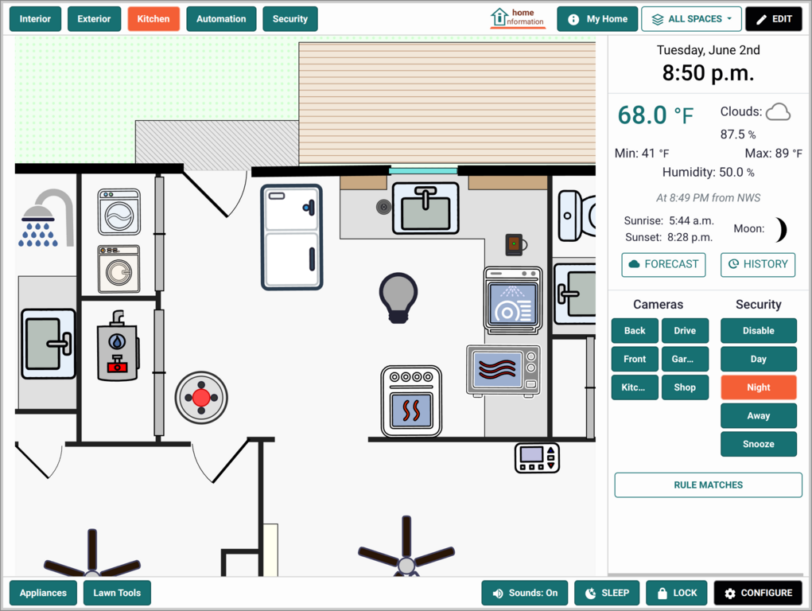
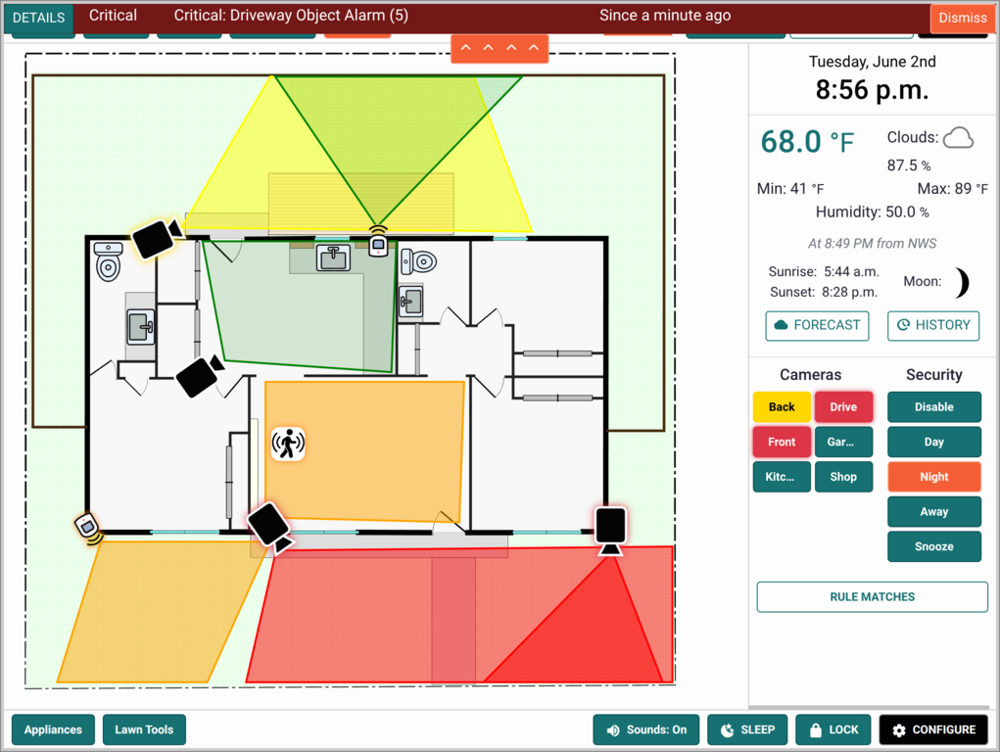
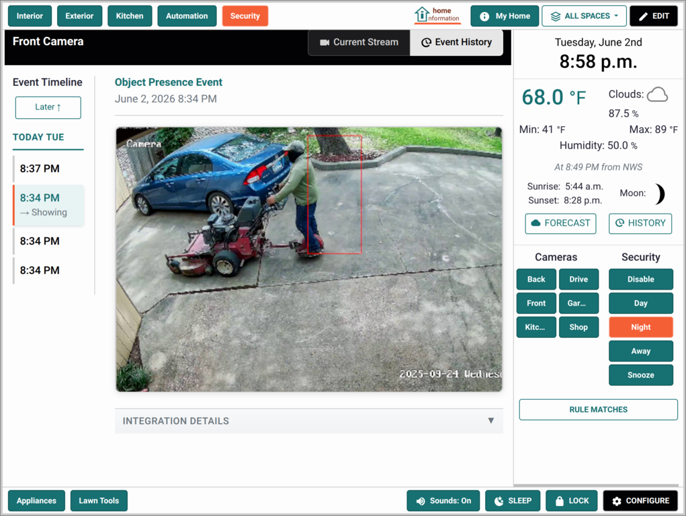

# Home Information

**Finally, a single place for all your home's information.**

Home Information transforms how you manage your property by creating a visual, spatial, centralized hub for everything about your home. Instead of hunting through drawers, email attachments, and scattered notes, you'll have manuals, maintenance records, device controls, and security monitoring all organized exactly where they belong - visually positioned on a map of your home.

 &nbsp;  &nbsp; 

## Why Home Information?

**The Problem:** Home automation and security systems give you device control, but they don't help you organize the information that makes your home truly manageable. Where did you put the HVAC manual? When was the water heater last serviced? Which camera covers the back door?

**Our Solution:** A spatial, visual approach to home information management that mirrors how you actually think about your home - by location and context, not by device type or vendor.

**Perfect for:**
- **Homeowners** who want to stay organized and maintain their property effectively
- **Tech-savvy households** ready to move beyond scattered digital notes and files
- **People with integrated homes** using security systems, home automation, or smart devices

See [Why Home Information?](docs/WhyHomeInformation.md) for more details on our approach.

## Quick Start

**Requirements:** [Docker](https://docs.docker.com/get-docker/) installed and running.

**Get running in only minutes:**

```shell
curl -fsSL https://raw.githubusercontent.com/cassandra/home-information/master/install.sh | bash
```

**Then visit:** [http://localhost:9411](http://localhost:9411)

The install script automatically handles everything: Docker setup verification, secure credential generation, and application startup.

**New to the interface?** Follow the [Getting Started Guide](docs/GettingStarted.md) for a walkthrough.

**Need more control?** See the [Installation Guide](docs/Installation.md) and [Deployment Options](docs/Deployment.md) for more options.

## What You Can Do

**Information Management:**
- Upload and organize manuals, warranties, and documents by location
- Store notes and specifications for every item in your home
- Track maintenance histories and repair records
- Link to information stored in other apps like [Paperless-ngx, HomeBox and Immich](docs/Integrations.md)

**Visual Organization:**
- Position items exactly where they belong on floor plans or property maps
- Create multiple views (whole house, kitchen only, security zones, etc.)
- Customize the floor plan to match your home and property

**Home Automation Integration:**
- Control lights, switches, and devices through [Home Assistant](docs/Integrations.md)
- Monitor device states and histories
- Set up automated alerting rules

**Security & Monitoring:**
- Integrate with [Frigate or ZoneMinder](docs/Integrations.md) for camera management
- Visual security zone monitoring with color-coded status
- Email alerts and customizable alarm sounds
- Browse video event histories

See the complete [Features List](docs/Features.md) for details.

## Project Status

**Ready for Early Adopters** - All core features are implemented and functional. We're looking for users who want to help refine the experience and identify areas for improvement.

**What's Working:**
- Full information management and visual organization
- Floor plan editor
- Home Assistant, Frigate, Paperless-ngx, HomeBox, Immich and ZoneMinder integrations
- Security modes, monitoring and alerts
- Multi-location and multi-view support

**What's Evolving:**
- UI polish in some areas (fully functional, but could be prettier)
- Additional integrations based on user demand
- Mobile experience optimization

## Contributing

We welcome all types of contributions:

**Users:** Try the app and share your experience - what works, what doesn't, what's missing

**Developers:** Help improve the codebase. Built with Django, JavaScript, and Bootstrap. See [Development](docs/Development.md).

**Designers:** Help us improve the user experience and visual design. We'd love your input on making this more intuitive and beautiful.

**Home Automation Experts:** Help us understand what integrations would be most valuable.

See [Contributing Guidelines](CONTRIBUTING.md) for details.

## Architecture & Security

- **Local-first:** Your data stays on your network. No cloud services required.
- **Integration-friendly:** Designed to work with existing home automation and security systems
- **Docker-based:** Consistent deployment across platforms
- **Django backend:** Mature, secure web framework
- **SQLite storage:** Simple, reliable data management

For technical details, see our [Development Documentation](docs/Development.md).

---

## Resources

### Users
- [Installation](docs/Installation.md) - Setup, day-to-day management, updates, troubleshooting
- [Features](docs/Features.md) - Complete feature overview
- [Getting Started](docs/GettingStarted.md) - First-time user walkthrough
- [Layout Editor](docs/Editing.md) - Show how to use the layout editor
- [Integrations](docs/Integrations.md) - Home Assistant, Frigate, Paperless-ngx, Immich, HomeBox and ZoneMinder setup
- [Deployment Options](docs/Deployment.md) - Network access, custom compose stacks, production configuration
- [FAQ](docs/FAQ.md) - Common questions and answers

### Contributors  
- [Contributing](CONTRIBUTING.md) - How to get involved
- [Development](docs/Development.md) - Technical setup and guidelines
- [Code of Conduct](CODE_OF_CONDUCT.md) - Community standards
- [Security](SECURITY.md) - Security policy and reporting

### Project
- [ChangeLog](CHANGELOG.md) - Release history
- [License](LICENSE.md) - MIT License terms
