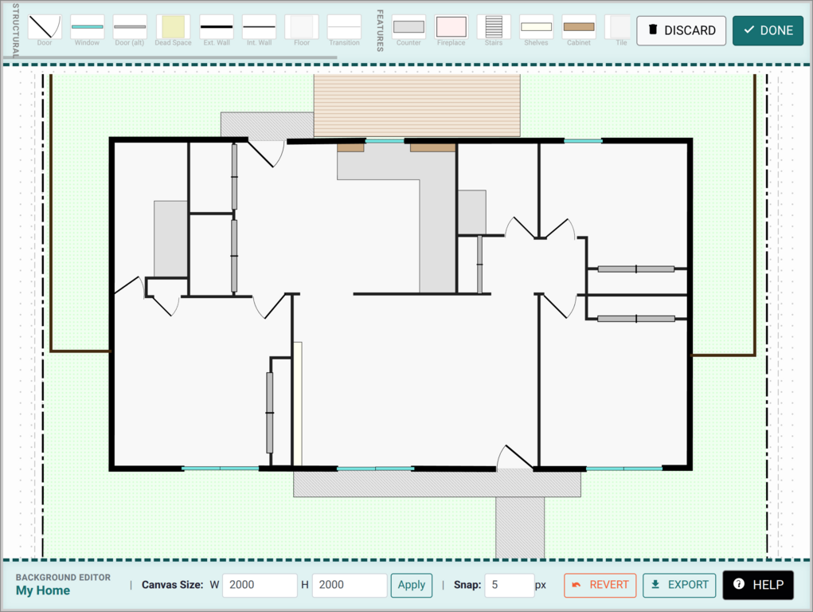
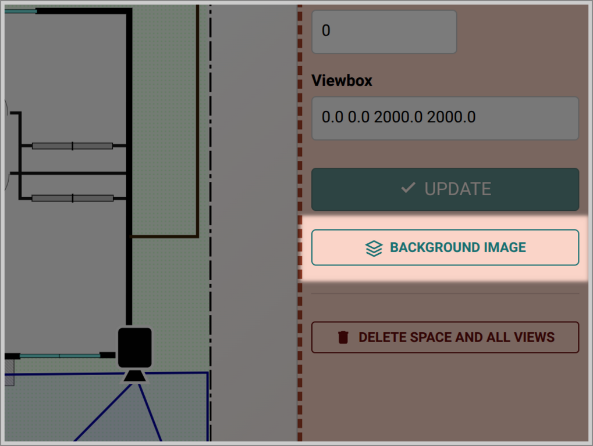
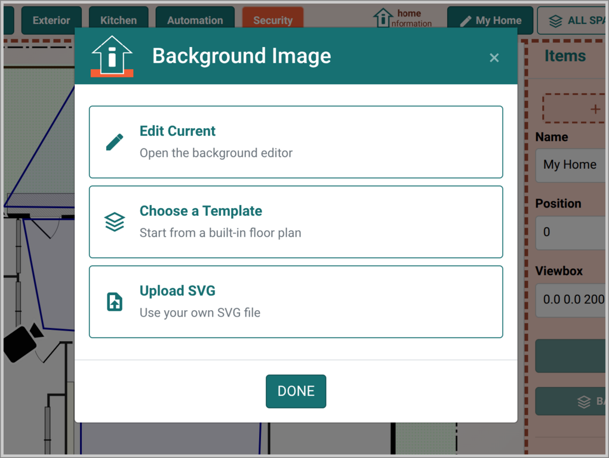
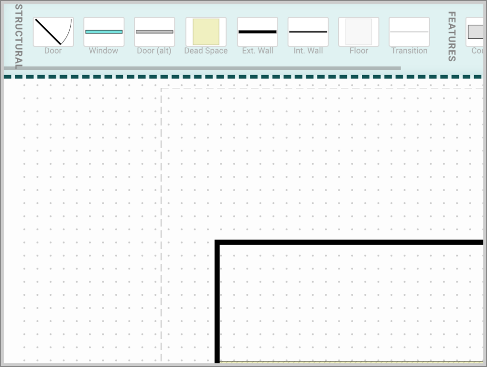
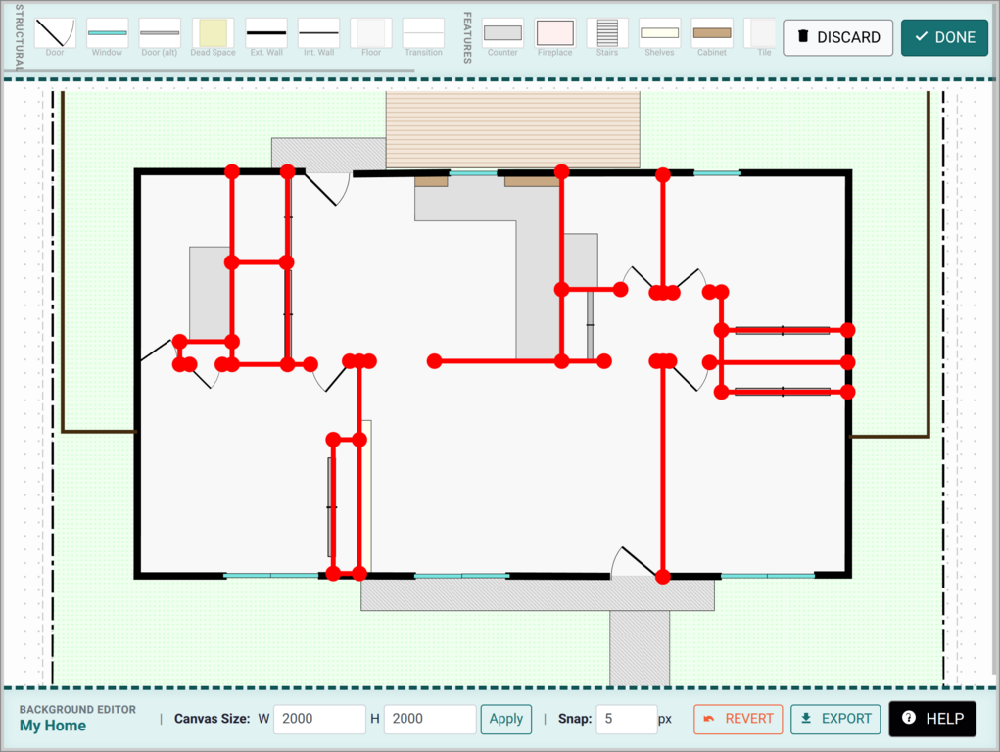
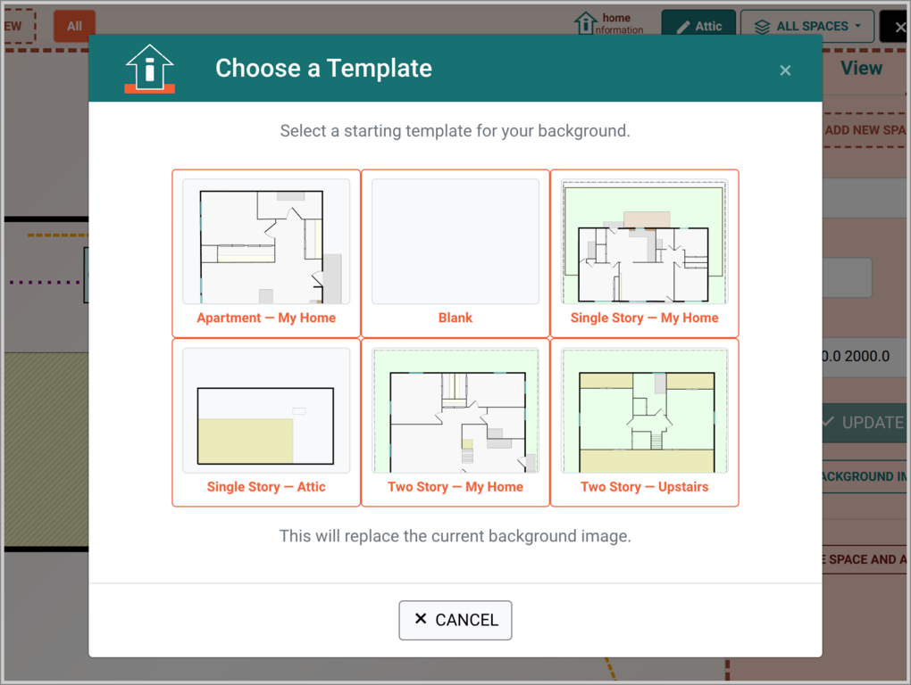

# Creating Floor Plans

Home Information includes a built-in floor plan editor that lets you draw your home's layout directly in the app. No external design tools needed — you can create walls, doors, windows, floors, and landscape elements all from your browser or tablet.

If you'd rather not draw your own, you can pick from a set of predefined templates or upload an SVG file you've created elsewhere.

## Getting Started

The floor plan is the background image for each Space (Location) in the app. To create or change it:

1. Enter **Edit Mode** using the Edit button
2. Switch to the **Space** tab in the sidebar
4. Click the **BACKGROUND IMAGE** button in the Space properties panel sidebar
5. Choose **Edit Current** to open the floor plan editor from modal selection

 &nbsp; 

From the Background Image dialog, you can also:
- **Choose a Template** — pick from predefined floor plans to use as-is or as a starting point
- **Upload SVG** — use an SVG file created in an external tool

## The Floor Plan Editor

The editor is a full-screen workspace with your floor plan in the center, an element palette across the top, and controls in the header and footer.

### Adding Elements

Drag any element from the palette and drop it onto the canvas. Elements are organized into three categories:

- **Structural** — walls, floors, doors, windows
- **Features** — countertops, fireplaces, stairs, shelves, cabinets
- **Exterior** — grass, ground, pavement, deck, fencing, property lines

 &nbsp;  

### Editing Elements

Click any element to select it. Walls, floors, and areas show red vertex points that you can drag to reshape. Doors and windows can be dragged to reposition, and scaled or rotated using keyboard shortcuts.

Use **Ctrl+drag** on a vertex to move an entire wall or floor without reshaping it. Press **m** to mirror a door or window horizontally.

The **HELP** button in the footer bar shows the complete list of keyboard shortcuts and editing commands.

### Navigating the Canvas

Zoom with the mouse wheel or **+** / **-** keys. Click and drag on empty space to pan.

## Saving Your Work

Changes are auto-saved as you work. When you're done:

- **DONE** — saves your changes and returns to the normal view
- **CANCEL** — discards all changes since you entered the editor
- **REVERT** — discards changes but stays in the editor (start over)

Your changes are saved to a draft while editing. If your browser closes unexpectedly, your work is preserved — the editor will resume where you left off next time you open it.

## Templates

The template selector shows visual previews of all available floor plans. Selecting a template replaces the current background.

 &nbsp; 

Templates are a good starting point — select one that roughly matches your layout, then use the editor to customize it.

## Tips

- **Start with the outline** — draw exterior walls first to establish the shape of your home, then add interior walls, floors, and openings.
- **Zoom in** for detail work on doors and windows.
- **You can always come back** — the editor is available any time from Edit Mode.

## Uploading External SVGs

If you have an SVG file from another tool (an architect's floor plan, a tracing, etc.), you can upload it via the **Upload SVG** option in the Background Image dialog. Uploaded SVGs render as the background, and you can add editor elements on top of them. Note that elements in uploaded SVGs cannot be individually edited — only elements added through the editor are editable.

## Exporting

The **EXPORT** button in the editor footer downloads your floor plan as a standalone SVG file. This is useful for sharing floor plans with others or backing up your work.
