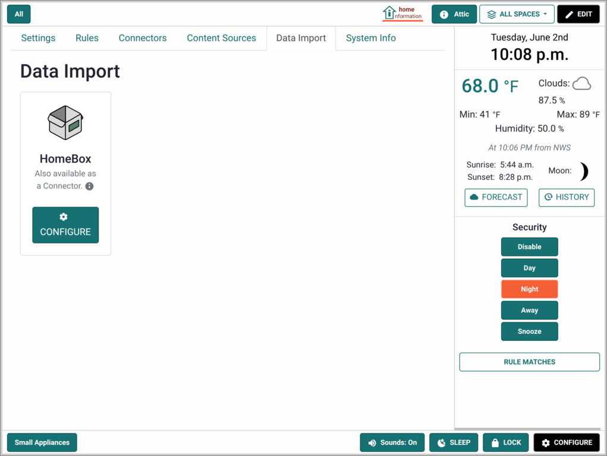
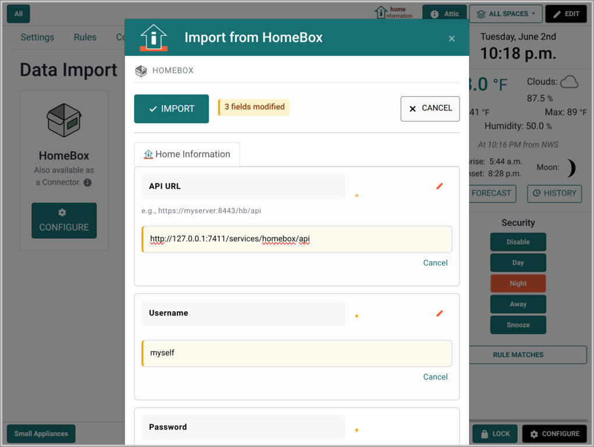
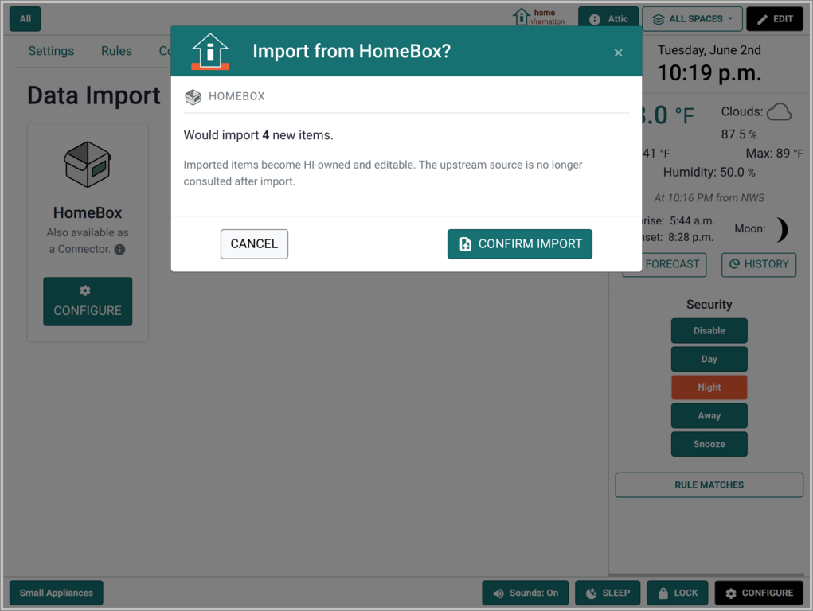
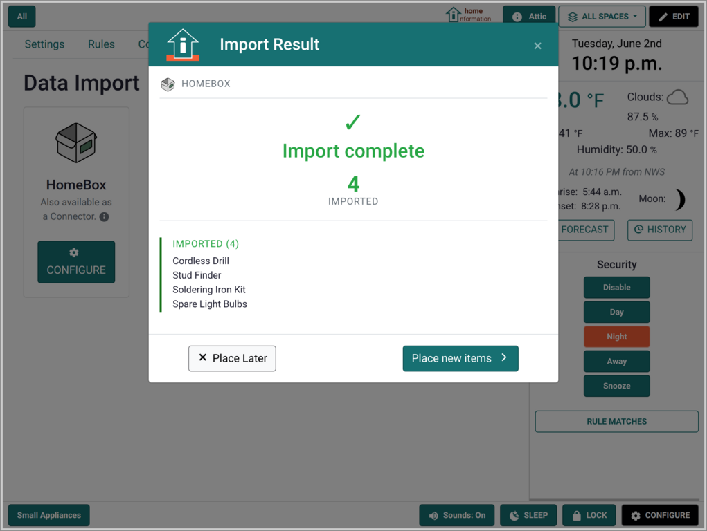
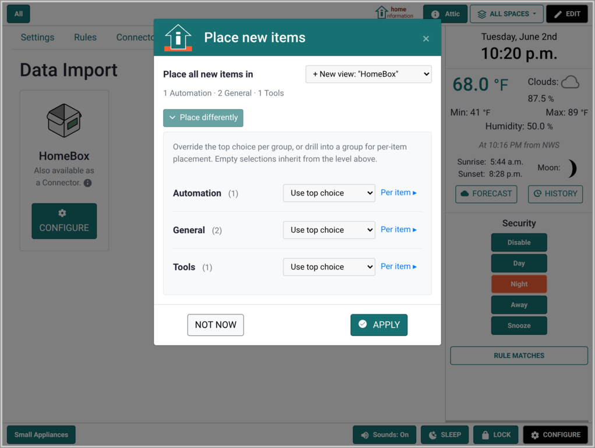

# Data Import

Data Import is a one-time copy of items from an upstream system into
Home Information (HI). Once imported, the items are HI-owned: you
can edit them freely, and they no longer depend on the upstream
source.

This is distinct from an
[Integration](Integrations.md), which mirrors the upstream live —
the upstream remains the source of truth and changes flow in via
update. Data Import has no ongoing relationship with the upstream
after the import completes.

## Importing data

1. Open HI's configuration area and go to the Data Import section.
2. Choose the integration you want to import from and start its
   configure flow.
3. Fill in the credentials and submit the import action.
4. A preview shows how many new items will be imported and how many
   existing ones will be skipped. Confirm to proceed.
5. The result shows what was imported. From there you can place the
   new items into a location view or collection.

You can re-run the same workflow later to bring in any new upstream
items; existing imports are skipped by upstream identifier.

 &nbsp; 

 &nbsp;  &nbsp; 

## Discarding imported data

To remove imported items along with their custom data and attached
files, use the discard action on the integration's row in the Data
Import section. The action is confirmed and cannot be undone — to
bring the items back you would need to re-import.

## Available imports

- **[HomeBox](integrations/homebox.md#data-import)** — copy your
  HomeBox inventory into HI as locally-owned items, with custom
  fields and attached files preserved.

More integrations will offer Data Import based on user feedback.
