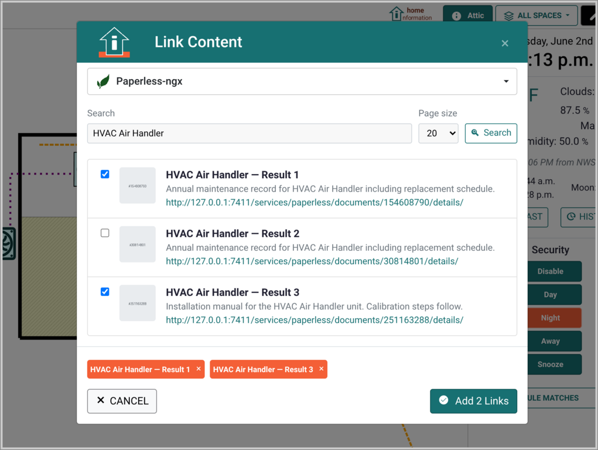
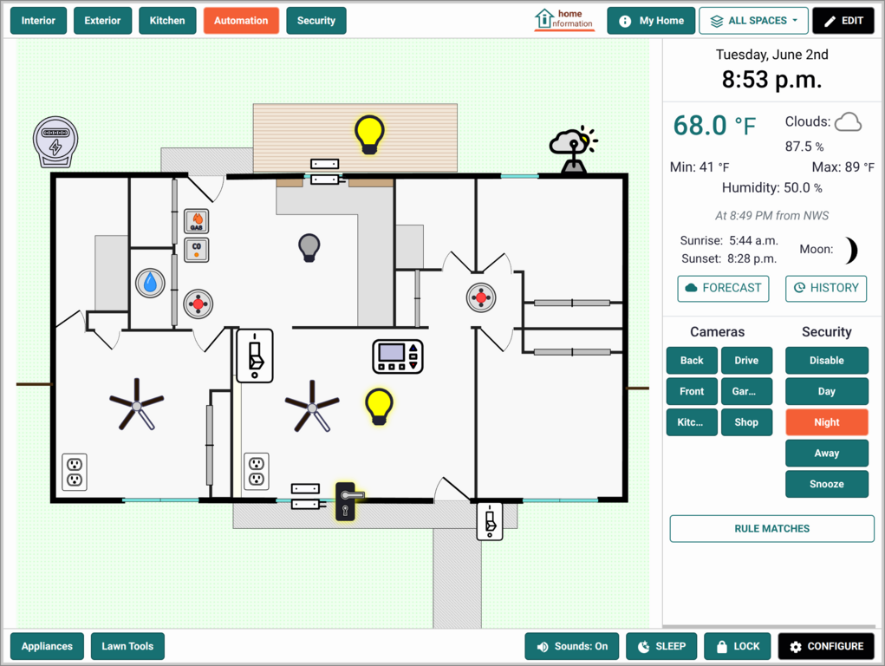
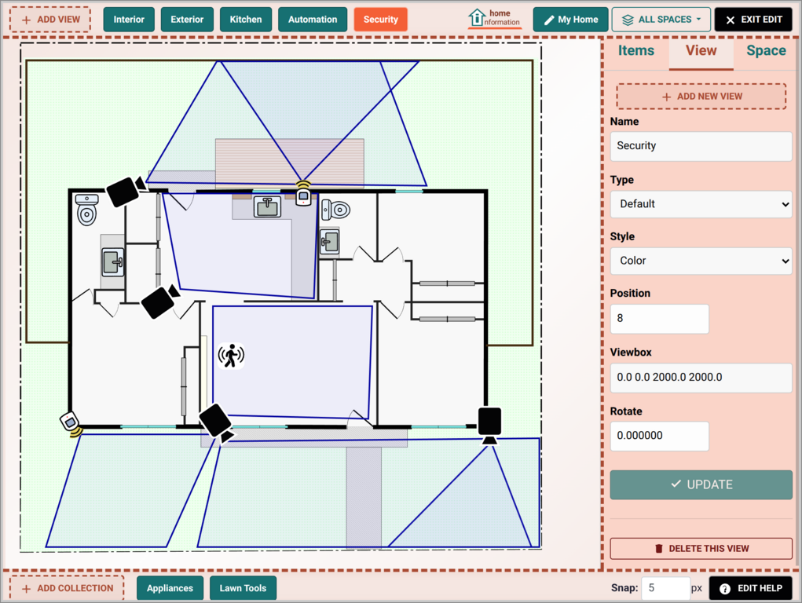

# Features

Home Information provides comprehensive tools for organizing, monitoring, and controlling all aspects of your home. Features are organized by the value they provide to you as a homeowner.

## Information Management & Organization

**What it does:** Store, organize, and access all your home-related documents, notes, and data using a visual, location-based approach.

 &nbsp; 

### Spatial Data Organization
- **Position items visually** on floor plans or property maps
- **Multiple location support** - separate views for different floors, attic, basement, or outdoor areas
- **Custom background images** - edit your floor plans, upload property surveys/photos of your actual spaces
- **Flexible item types** - individual items (appliances, fixtures), areas (pool, garden), or linear features (electrical lines, plumbing)

**Real-world benefit:** Instead of searching through folders for "kitchen appliance info," you click on your kitchen and see all relevant information right where you'd expect it.

### Document & Information Storage
- **Upload any file type** - manuals, warranties, photos, receipts, inspection reports
- **Rich text notes** - maintenance logs, specifications, installation notes
- **Attribute system** - structured data like model numbers, purchase dates, service providers
- **Full search** across all stored information (future)

**Use case example:** Your dishwasher starts making noise. Click on it to instantly see the manual, warranty info, installation date, and service history - everything you need to decide whether to call for service or attempt a repair.

### Multi-View Organization
- **Location Views** - different perspectives of the same physical space (All Items, Kitchen Focus, Security Zones)
- **Collections** - organize portable items like tools, small appliances, or seasonal decorations
- **Zoom and focus** - save specific view settings for easy navigation to areas of interest

**Perfect for:** Managing complex properties where a single view becomes cluttered, or focusing on specific systems (like showing only HVAC-related items, utilties, irrigation system).

### Content Linking
- **Paperless-ngx** - Link documents and images to any items on your floor plan
- **Immich** - Link images and videos to any items on your floor plan

### HomeBox Inventory Integration
- **Item synchronization** - automatically link items from HomeBox into your home layout
- **Attribute display** - view item details, warranties, purchase info, and custom fields
- **Attachment support** - access documents and photos attached to HomeBox items

**Use case example:** You track all your appliances and tools in HomeBox. Home Information pulls them in so you can position them on your floor plan alongside your smart home devices, giving you a complete view of everything in your home.

## Home Automation & Device Control

**What it does:** Integrate with existing home automation systems to provide device control within the spatial context of your home.

### Home Assistant Integration
- **Device control** - lights, switches, sensors, and other Home Assistant-managed devices
- **Status monitoring** - real-time device states displayed visually on your home layout
- **Historical data** - device state change histories and usage patterns
- **Automated rules** - create rules that raise alerts or run actions when entity states match defined conditions

**Real-world benefit:** Instead of opening a separate app and navigating device lists, you see device status right on your home map and control them in context with a single tap.

### Event & Automation System
- **Visual rule builder** - create automation rules using the spatial interface
- **Cross-system integration** - rules can involve devices from different platforms
- **Event history** - track what happened when across all your systems

**Use case example:** Set up a rule where motion detected in the driveway (security system) automatically turns on the porch light (home automation) and sends you an alert with the camera view.

### Weather & Environmental Data
- **Local weather integration** - current conditions and forecasts using your exact coordinates
- **Astronomical data** - sunrise/sunset, moon phases for outdoor lighting and security planning
- **Integration with local sensors** - if you have weather stations or environmental monitoring (future)

## Security & Monitoring

**What it does:** Unify security monitoring, alerts, and camera management within your home's spatial context.

### Visual Security Management
- **Security zone visualization** - see armed/disarmed status using color-coded zones on your home layout
- **Multi-mode support** - different security profiles (Home, Away, Sleep) with different zone configurations
- **Historical security data** - track arm/disarm events, sensor triggers, and security system activity

**Real-world benefit:** At a glance, see which areas of your home are secured and quickly identify any issues without navigating through security system menus. Set up different alerting rules for when you are home, away or at night.

### Frigate and ZoneMinder Camera Integration
- **Camera positioning** - place camera icons exactly where cameras are located and define the areas they cover
- **Live stream access** - click on camera icons to view live feeds
- **Event browsing** - review object and motion detection events and recordings
- **Auto-viewing** - automatically display relevant camera feeds when alarms trigger

**Use case example:** Motion sensor triggers in the backyard. The system automatically shows you the backyard camera feed while logging the event and can send email alerts with relevant information.

### Alert & Notification System
- **Visual alerts** - on-screen notifications with color-coded severity
- **Audio alerts** - customizable sounds for different event types
- **Email notifications** - stay informed when away from home
- **Smart filtering** - avoid alert fatigue with intelligent event prioritization

### Advanced Security Features
- **Event correlation** - connect security events across different systems (motion + camera + lights)
- **Alarm history** - comprehensive logging and analysis of security events
- **Customize security modes** - define your own security profiles for Home/Away/Sleep

## User Interface & Experience

**What it does:** Provide intuitive, efficient ways to interact with all your home information and systems.

### Visual Navigation
- **Spatial interface** - navigate by clicking on areas of your home
- **Zoom controls** - focus on specific areas or see the big picture
- **Multiple view modes** - switch between different perspectives of your home
- **Touch-friendly** - works well on tablets and touch displays

### Screen Management
- **Sleep mode** - dim the interface for always-on displays without disrupting functionality
- **Screen lock** - temporary password protection for when visitors are present
- **Sound controls** - mute/unmute alerts and system sounds
- **Always-on friendly** - designed for dedicated home displays

### Editing & Administration
- **Visual editing mode** - drag and drop items, resize, and reshape areas
- **Floor Plan Editor** - integrated editor for creating custom floor plans to match your home
- **Bulk operations** - efficiently manage multiple items or data imports
- **User management** - multiple user accounts with different access levels (optional)
- **Backup & restore** - keeps history of all information changes and one-click restoring

**Perfect for:** Households that want a dedicated home management display, or anyone who prefers visual organization over list-based interfaces.

## Integration & Extensibility

**What it does:** Work with your existing home technology investments and provide a platform for future expansion.

### Current Integrations
- **Home Assistant** - Complete integration with the popular open-source home automation platform
- **Frigate** - Full-featured security camera management with object detection
- **Paperless-ngx** - Full featured document management, OCR, search.
- **HomeBox** - Home inventory management and item tracking
- **Immich** - Rich image and photo album management
- **ZoneMinder** - Full-featured security camera management with motion detection
- **Weather APIs** - National Weather Service and OpenMeteo for local conditions

### Integration Architecture
- **API-based** - clean interfaces for adding new integrations
- **Local-first** - integrations work within your network, no cloud dependencies required
- **Modular design** - enable only the integrations you need (or none at all)

### Data Management
- **Local storage** - all data stays on your devices using SQLite
- **File management** - uploaded documents stored in organized directory structure
- **Export capabilities** - protect your data investment with export options
- **Privacy by design** - no external data sharing unless you explicitly configure it

**Future-ready:** The platform is designed to accommodate new integrations as your needs evolve or new home technologies emerge.

## Getting Started Benefits

**Day 1 Value:** Even before setting up any integrations, you can start organizing your home information and see immediate benefits from having everything in one visual interface.

**Progressive Enhancement:** Start simple with just information management, then add device integration and monitoring as you have time and interest.

**Flexible Implementation:** Works equally well for simple documentation needs or complex multi-system integration scenarios.

**Investment Protection:** Integrates with existing systems rather than requiring you to replace working technology.
