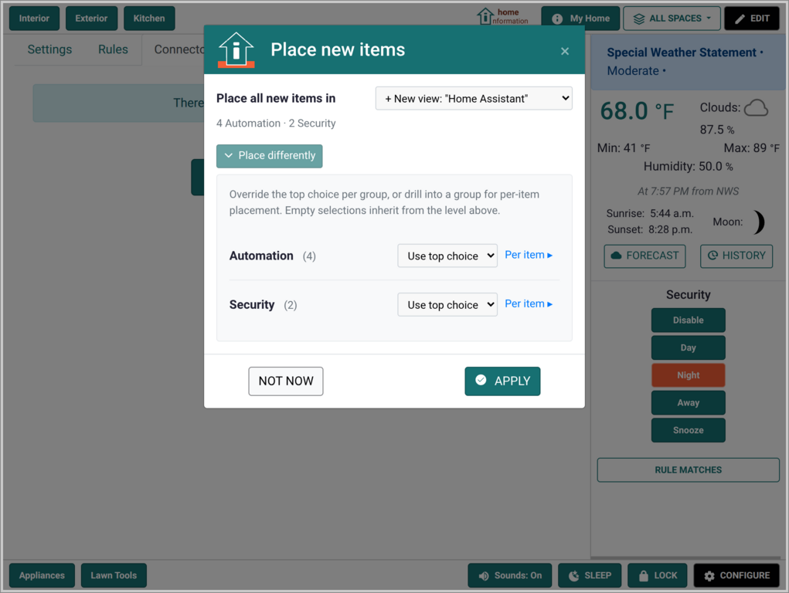

# Getting Started

Once successfully running (see the [Installation Page](Installation.md)), you will be greeted with:

 

Choose which home type you want to use. If you choose "Two Story", you will see this initial screen with some common household items pre-populated.

These provide defaults to get started quickly. You can add, remove and customize these as much as you want afterwards.

## Adding Information

To core feature of Home Information is managing information about your home and the things in it.  To add information, tap on any of the items and you will see the main information view/edit dialog. Initially, it looks like this:

Use the "Add Info" button to add some information about the item. Or use the "Add File" button to upload a document or image:

 &nbsp; 

Some information may not be associated with an individual item, but the overall home itself. For that, use the top-right button to add the information to the home itself.

 &nbsp; 

## Multiple Spaces

If you have a multi-story house, basement, attic or even another vacation home or second property, you can create a different "space" for that.  Here we have an extra space defined for the second floor rooms and crawl spaces.

 &nbsp; 

## Collections

Not everything in your home has a well defined location or needs a spatial position. For these items you can use the "collections" bottom buttons which offer different list and grid layouts.

 &nbsp;  &nbsp; 

## Weather

There are some default weather integrations which provide weather data and alerts. Tap on the weather information panel to drill into more details about weather or astronomical data.

 &nbsp; 

Seen sunrise times, sunset, moon phase, weather history and more.

 &nbsp; 

## Controls and Settings

Control alert sounds, screen brightness and lock your screen. The alerts and display keep running so you do not miss anything. For accurate weather and time, be sure to set your timezone and geographic location in the configuration pages.

 &nbsp; 

## Layout Editing

You have full control of the layout of your items and the background image. These are all managed by choosing "EDIT" and entering a special "Editing Mode".

 &nbsp; 

The [Editing Page](Editing.md) has many details on how to use the editor.

## Integrations

For connecting to other applications, go to the configuration area to enable one of the current integrations (e.g., Home Assistant).

 &nbsp; 

After enabled, you can connect all the items to add them to your views and collections.

 &nbsp;  &nbsp;  

See the [Integrations Page](Integrations.md) for more details.
 
### Cameras

If the integation provides cameras with video feeds (e.g., Frigate, ZoneMinder), the cameras will appear in the side bar for easy access to their streams and for browsing the video stream history from past motion events.

 &nbsp; 

### Alert Rules and Security Modes

By default, if you have motion sensors, open/close sensors, camera motion, etc. the integration item import automatically creates alert rules.  You can view, refine and manage these in the configuration pages. The rules allow you to target different "security modes" for better control of what alerts and when.

 &nbsp; 

### Alerting Areas

In the editor, you can define areas and associate it with a device, like a camera.  Then, if the camera detects motion, both the camera and the area will be highlighted. A default area is created automatically when you connect devices with motion sensing ability.

 &nbsp; 

The highlighting will change color over time so you can see what is currently alarming, recently alarmed or what was active in the near past.

 &nbsp; 

## Additional Details

### Custom Background Images

In the editor, you can swap out the default property/house images for your own custom images.  See the [Custom Background Image Page](CustomBackgrounds.md) for more details.

### Alert Sounds

For features that use sounds (e.g., alerts), this allows toggling to mute and unmute.  The alert sounds are considered "auto-play" by browsers, so you may need to allow this in the browser in order to hear the alert sounds.  If you see "blocked' on this button, click it to see more info about fixing it.

### Locking Feature

When visitors are in your house, be they friends, acquaintances, service or maintenance people, you may want to temporarily lock the screen so they cannot access the information you've stored. To unlock, it uses a password you set the first time you lock the screen.  This is is just a light security convenience against casual snooping. Locking the device itself is better protection.

