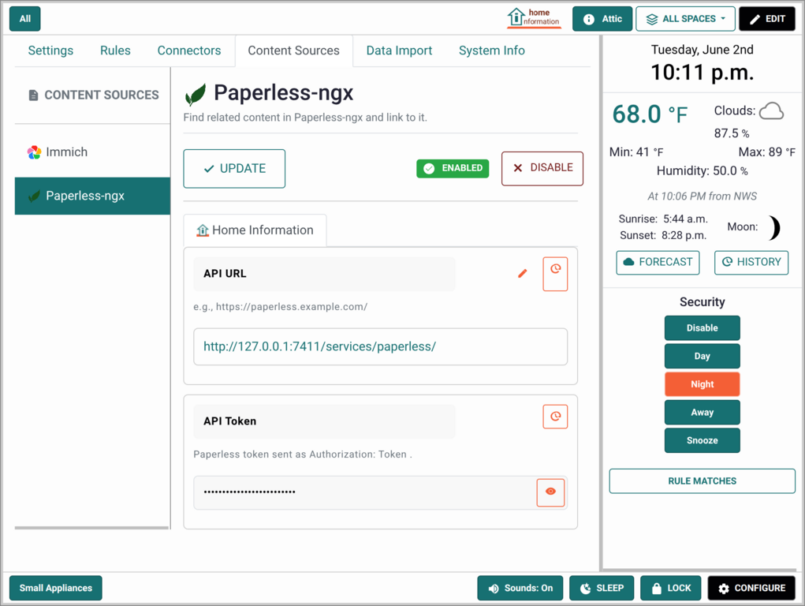
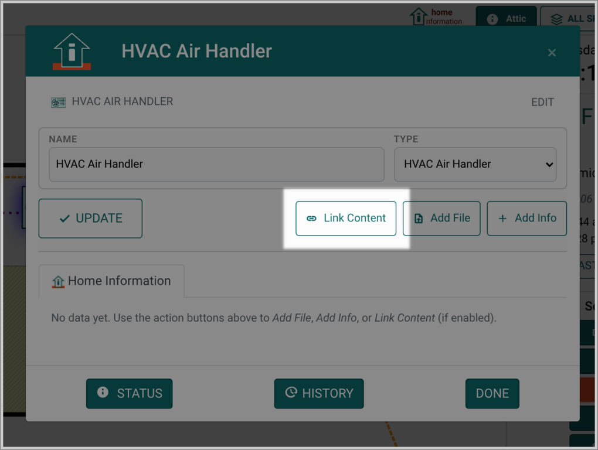
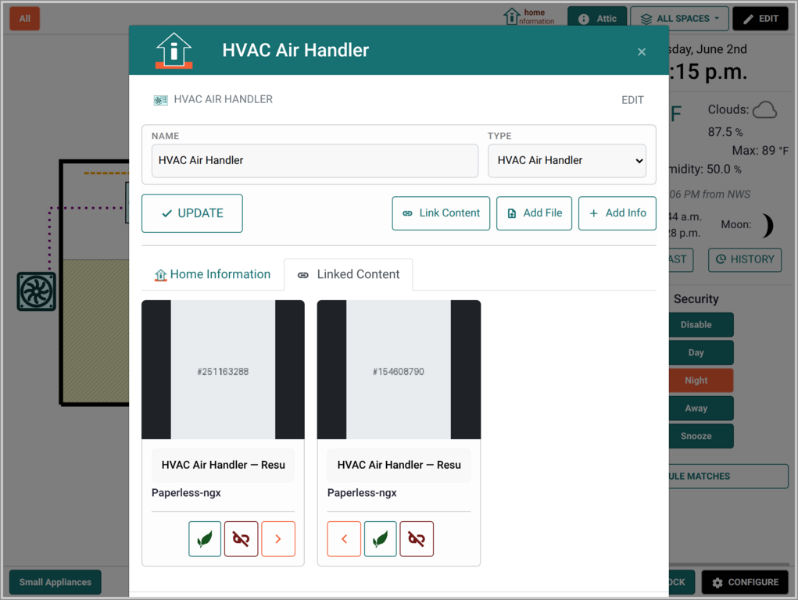

# Integrations

Home Information (HI) can optionally integrate with external systems to
connect items from them — alongside your own items and items from any
other integrations you enable. Integrations are not required; HI
works without any of them. Each integration has its own setup steps,
credentials, and caveats — see the per-integration page for details.

You will usually need credentials for the upstream service before starting;
the per-integration pages below cover what to obtain and where to
enter it.

## Types of Integrations

- **Connectors** — Adds new items to Home Information and connects their data to the external system.  Home Information provides the spatial display, but the external remains the source of truth for the item.
- **Content Sources** — Allows linking documents, files and images in external systems to existing Home Information items.  These can be items you created in Home Information, or items you connected from other systems.
- **Data Import** — Add new items to Home Information from external sources.  Unlike connectors, this copies all the data and Home Information becomes the source of truth for the data.  Any changes in the external source will not be reflected in Home Information.

All integrations can be enabled and managed on the config page using the lower right **CONFIGURE**. Each integration type has their own configuration tab.

## Connectors and Content Sources vs. Data Import

Most integrations are live: HI mirrors the upstream
system continuously and changes flow in via the update action.
Content-source integrations (Paperless-ngx, Immich) are a different
shape — they contribute attachable references rather than importing
items, and they talk to the upstream service only when the operator
opens the picker.

A separate feature, [Data Import](DataImport.md), is a one-time
copy with no ongoing upstream link. Some integrations (HomeBox
today) offer both options.

## Enabling an integration

### Connectors

For a Connectors integration:

1. In HI, click **CONFIGURE** at the bottom of the screen.
2. Select the **Connectors** tab.
3. Open the integrations picker:
   - If no integrations are configured yet, click **CONFIGURE
     INTEGRATIONS** in the main panel.
   - If at least one integration is already configured, click
     **INTEGRATIONS** at the top of the sidebar.
4. Choose the integration you want to add and follow the
   configuration steps on its per-integration page below.

 &nbsp; 

 &nbsp; 

### Content Sources

For a Content Source integration:

1. In HI, click **CONFIGURE** at the bottom of the screen.
2. Select the **Content Sources** tab.
3. Select the tab for the content source to configure
4. Fill in the URL and credentials, then click **ENABLE**

Once enabled, you will see an extra **Link Content** button when you are editing items. Clicking that brings up a search dialog that searches the external source where you can select the content to link to the item. Once linked, when you open the item, that content will show up.

 &nbsp;  &nbsp; 

### Data Import

See [Data Import](DataImport.md)

## Available integrations

- **[Home Assistant](integrations/home-assistant.md)** — general-purpose
  home automation platform. Imports HA entities (lights, switches,
  sensors, cameras, climate devices, and more) and dispatches control
  actions back to HA.
- **[Frigate](integrations/frigate.md)** — open-source NVR with
  object detection. Imports Frigate cameras with an object-presence
  sensor that drives event playback in HI.
- **[Paperless-ngx](integrations/paperless-ngx.md)** — document
  management. Does not import items; instead lets you search
  paperless from inside HI and attach matching documents (warranty
  PDFs, manuals, receipts) as link references on items and
  Locations you already have.
- **[HomeBox](integrations/homebox.md)** — home inventory tracking.
  Imports HomeBox items as read-only HI items with custom fields and
  attached files (manuals, receipts, photos).
- **[Immich](integrations/immich.md)** — self-hosted photo and video
  library. Does not import items; instead lets you search Immich
  from inside HI and attach matching assets (appliance photos, room
  snapshots, serial-plate shots) as link references on items and
  Locations you already have.
- **[ZoneMinder](integrations/zoneminder.md)** — open-source video
  surveillance. Imports ZM monitors as cameras with motion sensors and
  function controllers; provides live stream playback in HI.

More integrations will be added as demand arises. The per-integration
pages each carry their own troubleshooting section that accretes
real-world fixes over time — start there if something is not working.
