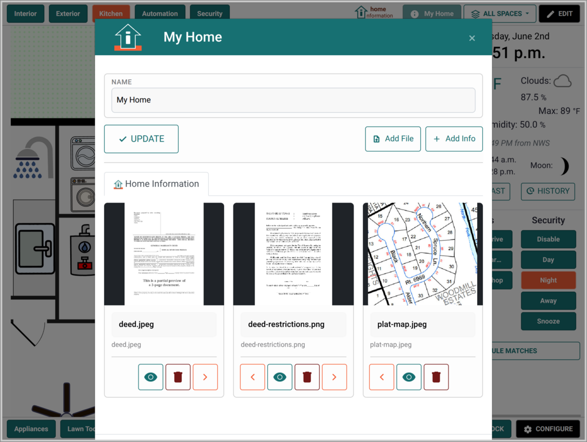

# Why Home Information?

 &nbsp; 

## The Home Information Problem

Modern homes are more complex than ever. Between smart devices, security systems, appliances, maintenance schedules, warranties, and documentation, homeowners are drowning in scattered information. Consider these common frustrations:

- **"Where did I put the HVAC manual?"** - Important documents get lost in email attachments, filing cabinets, or forgotten cloud folders
- **"When was the water heater last serviced?"** - Maintenance histories live in different apps, notebooks, or not at all
- **"Which security camera covers the back door?"** - Device-centric interfaces don't match how we think about our homes
- **"What's the model number of that outlet in the guest room?"** - Product information scattered across purchase receipts, photos, and memory

## Why Existing Solutions Fall Short

**Device-Centric Thinking:** Most home automation platforms organize by device type or manufacturer. You have a "lights" section, a "cameras" section, a "sensors" section. But when you're standing in your kitchen wondering about the refrigerator's warranty, you don't want to navigate through a generic "appliances" category.

**Information Silos:** Your security system knows about cameras. Your home automation knows about switches. Your phone has photos of model numbers. Your computer has PDF manuals. Your notebook has maintenance records. Nothing connects.

**Complexity Over Simplicity:** Many systems add complexity rather than reducing it. You end up managing the management system instead of just managing your home.

## The Home Information Approach

**Spatial Organization:** We organize information the way you think about your home - by location and context. Draw your floor plan right in the app or upload one you already have, then click your kitchen to see everything kitchen-related, or click your HVAC unit to see its manual, service history, and current status all in one place.

**Information-First Design:** Instead of starting with devices and adding information as an afterthought, we start with information and integrate device control where it makes sense.

**Single Pane of Glass:** One interface for your documents, maintenance records, device controls, and security monitoring. Home Information works fully on its own - and if you already run other self-hosted apps, it brings them into the same spatial view instead of replacing them.

## Real-World Use Cases

### The Organized Homeowner
*Sarah wants to maintain her home proactively but struggles with scattered information.*

**Before:** Maintenance schedules in a phone app, manuals in a filing cabinet, warranty info in email, service contacts in an address book - and no systematic way to track what's been done when.

**After:** She clicks the HVAC unit to see its manual, service history, warranty expiration, and the installer's contact - everything needed to maintain that system in one logical place. It all lives in Home Information; no other apps required.

### The Tech-Savvy Household
*The Johnsons already run several self-hosted apps but find managing them overwhelming.*

**Before:** Home Assistant for devices, Frigate for cameras, Paperless-ngx for documents, Immich for photos, HomeBox for inventory - great apps, but five separate windows and nothing tied to where things actually are.

**After:** One floor plan shows it all in context. Click a room to control devices, review camera events, and open the right manual or photo - pulled live from the apps they already run. Home Information ties them together rather than replacing them.

### The Remote Owner
*Lisa owns a mountain cabin she visits monthly and needs to monitor it remotely.*

**Before:** Worrying about what might go wrong while away, difficult to check on systems remotely, and awkward handoffs to caretakers or repair services.

**After:** She checks system status and camera events from anywhere, with every service contact and manual a click away when something needs attention.

## Key Differentiators

### vs. Traditional Home Automation Platforms
- **Location-centric vs. device-centric organization**
- **Information management as core feature, not afterthought**
- **Integrates existing systems rather than replacing them**

### vs. Generic Information Management Tools
- **Spatial organization matches how you think about your home**
- **Purpose-built for home management use cases**
- **Optional integrations bring your other apps into the same view**

### vs. Maintenance Tracking Apps
- **Visual, contextual interface rather than lists and forms**
- **Integrates device status and control**
- **Supports all types of home information, not just maintenance**

## Philosophy: People-Centered Home Technology

We believe home technology should make life simpler, not more complex. That means:

**Starting with your mental model** - How do you think about your home? By rooms, by systems, by priorities. Not by manufacturers or device categories.

**Progressive enhancement** - Start with information management alone. Layer in device control, security, and connections to apps like Paperless-ngx or Frigate only as they add value. Integrations are always optional - Home Information works fully without any of them.

**Ownership and control** - Your home information stays in your home, under your control. No cloud dependencies for core functionality.

**Integration, not replacement** - Work with your existing investments in security systems, home automation, and smart devices rather than forcing you to start over.

The goal isn't to build another home automation platform. It's to create the missing piece that makes all your home technology actually useful for managing your life.
